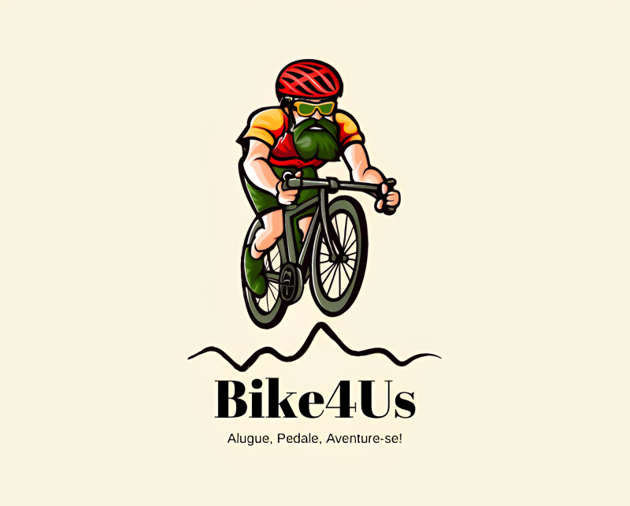

    

    <a href="#sobre">Sobre</a>  |  
    <a href="#backlogs">Backlogs</a>  |  
    <a href="#tecnologias">Tecnologias</a>  |  
    <a href="#equipe">Equipe</a>

   

  

# Bike4Us

> Um aplicativo web inovador que visa criar uma comunidade de entusiastas de bicicletas, conectando proprietários de bicicletas com pessoas que desejam alugá-las. Nosso objetivo é simplificar o processo de locação de bicicletas, proporcionando uma plataforma fácil de usar para encontrar a bicicleta perfeita para suas necessidades.

## Membros

<table>
  <thead>
    <tr>
      <th>Membro</th>
      <th>Cargo</th>
    </tr>
  </thead>
  <tbody>
    <tr>
      <td>Lucas Braz</td>
      <td>Product Owner</td>
    </tr>
    <tr>
      <td>Franciele Chesere</td>
      <td>Scrum Master</td>
    </tr>
    <tr>
      <td>João Procópio</td>
      <td>Dev</td>
    </tr>
    <tr>
      <td>Larissa Candido</td>
      <td>Dev</td>
    </tr>
    <tr>
      <td>Thiago Nathan</td>
      <td>Dev</td>
    </tr>
    <tr>
      <td>Danielle Sismonn</td>
      <td>Dev</td>
    </tr>
    <tr>
      <td>Matheus Santo</td>
      <td>Dev</td>
    </tr>
    <tr>
      <td>Rafael Estevam de Siqueira</td>
      <td>Dev</td>
    </tr>
  </tbody>
</table>

# 🎯 Backlog & User Stories

 ## 📌 Requisitos

<strong>Funcionais:</strong><

- O usuário deverá se cadastrar para usar a ferramenta;
- O usuário poderá cadastrar bicicletas fornecendo fotos, modelo, tipo (speed, MTB, BMX, passeio etc.), descrição e outros dados importantes para a identificação da bicicleta;
A locação poderá ser por dia ou hora;
- O mesmo usuário poderá ser locador e locatário;
- O usuário gerencia os parâmetros da locação de cada bicicleta fornecendo disponibilidade
e valor;
- O usuário poderá consultar as bicicletas disponíveis para locação fornecendo: distância, cidade, bairro, data e horário, preço, tipo etc.
- O usuário não precisará estar logado para consultar, mas precisará estar logado para obter o contato do locador. A comunicação entre o proprietário e interessado não será de responsabilidade da aplicação;
- O usuário deverá estar logado para cadastrar/alterar dados das bicicletas.
- O locatário poderá ser avaliado pelo locador e vice-versa, gerando uma pontuação de 0 a 5 estrelas.

 Não Funcionais:

- Documentação no GitHub;
- Processo Scrum;
- Documentação usando Swagger;
- Gerenciamento usando Trello;
- Back-end: TypeScript e Node.js;
- Front-end: React TypeScript, HTML e CSS;
- Armazenamento: SGBD PostgreSQL;
- A autenticação de usuário deverá ser por alguma conta de serviço, como Google, Facebook
ou outro.

## 📌 User Stories

**Prioridade Alta**

**Cadastro de Usuário:**

História:

Como usuário interessado em alugar ou disponibilizar bicicletas para aluguel, desejo me cadastrar no aplicativo para aproveitar os recursos da plataforma.

Critérios de aceite:

- O usuário deve ser capaz de se cadastrar no aplicativo fornecendo informações pessoais, como nome completo e endereço de e-mail.
- O cadastro do usuário pode ser realizado usando autenticação do Google para maior conveniência.
- Após o cadastro com sucesso, o usuário deve poder fazer login na plataforma usando as credenciais fornecidas durante o cadastro.

**Cadastro de Bicicleta:**

História:

Como usuário, desejo cadastrar minha bicicleta no aplicativo fornecendo informações básicas, como modelo, tipo, preço, marca e fotos.

Critérios de aceite:

- O proprietário da bicicleta deve poder cadastrar sua bicicleta no aplicativo.
- Durante o cadastro, o proprietário deve fornecer informações básicas da bicicleta, como modelo, tipo, preço, marca e fotos.
- O cadastro pode incluir outros detalhes relevantes da bicicleta para facilitar a escolha dos interessados.

**Prioridade Média**

**Filtro e Visualização de Bicicletas Disponíveis:**

História:

Como usuário interessado em alugar uma bicicleta, desejo poder visualizar as bicicletas disponíveis para aluguel por meio de filtros, como distância, cidade, bairro, data, horário, preço e tipo de bicicleta.

Critérios de aceite:

- O usuário deve ter a capacidade de filtrar as bicicletas disponíveis para aluguel com base em critérios como distância, cidade, bairro, data, horário, preço e tipo de bicicleta.
- O aplicativo deve mostrar uma listagem das bicicletas que atendem aos critérios de filtro selecionados.
- Para cada bicicleta, devem ser exibidas informações básicas, como modelo, localização e disponibilidade.
- O usuário deve poder visualizar informações detalhadas da bicicleta selecionada, como descrição, características e imagens adicionais.

**Definição de Disponibilidade e Valor de Aluguel:**

História:

Como usuário proprietário de uma bicicleta cadastrada no aplicativo, desejo poder definir a disponibilidade da minha bicicleta para aluguel e estabelecer o valor por hora ou dia.

Critérios de aceite:

- Após cadastrar a bicicleta no aplicativo, o proprietário deve poder definir a disponibilidade da bicicleta para aluguel.
- O proprietário deve poder estabelecer o valor por hora ou dia para o aluguel da bicicleta.

**Prioridade Baixa:**

**Avaliação da Experiência de Aluguel:**

História:

Como usuário, desejo poder avaliar minha experiência de aluguel atribuindo uma pontuação de 0 a 5 estrelas para o locatário e locador.

Critérios de aceite:

- Depois de concluir uma locação, o usuário deve ter a opção de avaliar a experiência de aluguel.
- O usuário deve poder atribuir uma pontuação de 0 a 5 estrelas para o locador e o locatário da bicicleta.
- A avaliação será opcional e não permitirá a inclusão de comentários além da pontuação.
- As pontuações atribuídas serão visíveis publicamente para outros usuários, fornecendo uma ideia da qualidade das transações anteriores.

## Vídeos de apresentação

[Apresentação da Sprint 1](https://www.youtube.com/watch?v=Q6sC1Ibycmo)
