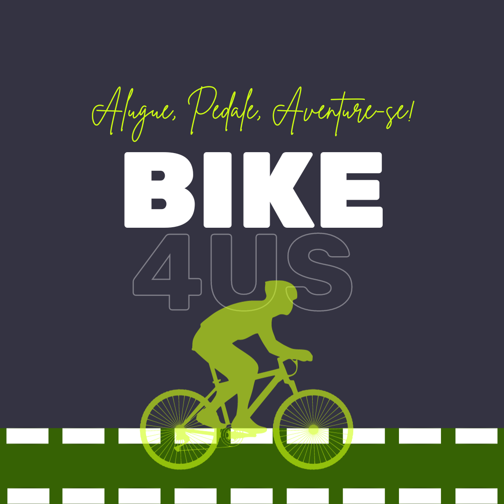

    

    <a href="#sobre">Sobre</a>  |  
    <a href="#backlogs">Backlogs</a>  |  
    <a href="#tecnologias">Tecnologias</a>  |  
    <a href="#equipe">Equipe</a>

   

  

# Bike4Us

> Um aplicativo web inovador que visa criar uma comunidade de entusiastas de bicicletas, conectando proprietários de bicicletas com pessoas que desejam alugá-las. Nosso objetivo é simplificar o processo de locação de bicicletas, proporcionando uma plataforma fácil de usar para encontrar a bicicleta perfeita para suas necessidades.

## Membros

<table>
  <thead>
    <tr>
      <th>Membro</th>
      <th>Cargo</th>
    </tr>
  </thead>
  <tbody>
    <tr>
      <td>Lucas Braz</td>
      <td>Product Owner</td>
    </tr>
    <tr>
      <td>Franciele Chesere</td>
      <td>Scrum Master</td>
    </tr>
    <tr>
      <td>João Procópio</td>
      <td>Dev</td>
    </tr>
    <tr>
      <td>Larissa Candido</td>
      <td>Dev</td>
    </tr>
    <tr>
      <td>Thiago Nathan</td>
      <td>Dev</td>
    </tr>
    <tr>
      <td>Danielle Sismonn</td>
      <td>Dev</td>
    </tr>
    <tr>
      <td>Matheus Santo</td>
      <td>Dev</td>
    </tr>
    <tr>
      <td>Rafael Estevam de Siqueira</td>
      <td>Dev</td>
    </tr>
  </tbody>
</table>

## Vídeos de apresentação

[Apresentação da Sprint 1](https://www.youtube.com/watch?v=Q6sC1Ibycmo)
